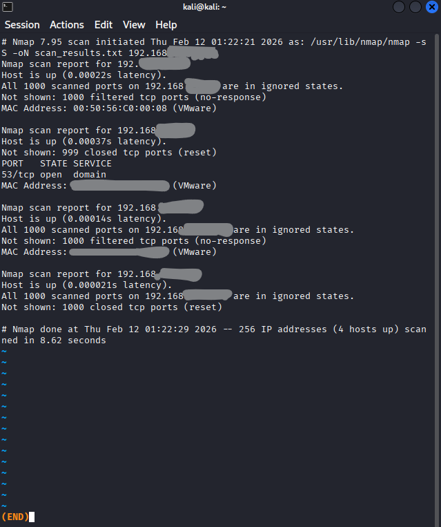
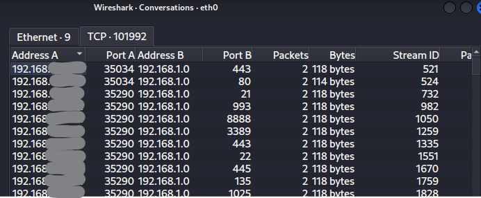

# Cybersecurity Internship – Task 1  
## Network Port Scanning using Nmap

### Objective
To scan a local network for open ports and understand network service exposure and basic security risks.

### Tools Used
- Nmap  
- Kali Linux  

### Steps Performed
1. Installed and verified Nmap on the system.  
2. Identified the local network range using `ip a`.  
3. Performed a TCP SYN scan on the local network using:
   ```bash
   sudo nmap -sS <LOCAL_NETWORK_RANGE> -oN scan_results.txt
4. Analyzed open ports and services.
5. Sanitized sensitive IP/MAC data before sharing.

## Results Summary

- Multiple hosts discovered on the local network
- One host had TCP port 53 (DNS) open
- Other hosts had filtered or closed ports

---

## 🔐 Security Implications

- Port 53 (DNS) was open — DNS servers can be targeted for spoofing attacks if misconfigured.
- Open ports increase the attack surface of a system.
- Services running on open ports may be vulnerable if not properly secured.
- Proper firewall configuration and service hardening reduce these risks.

**Disclaimer**

Scan was performed on my own lab/local network. Results are sanitized.
## 📸 Screenshots

### Nmap Scan


### Wireshark Analysis

